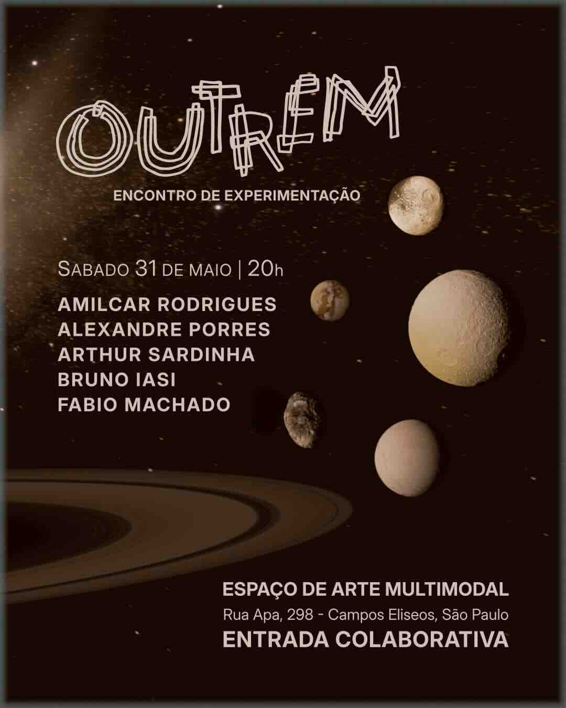

As a composer and musician, I have a varied background in diverse activities. I have done soundtracks for short films, animation and live plays. I've written instrumental, electronic, mixed pieces and I’ve also worked with experimental and even pop music. As a performer, most of my work is in live electronics.

In the last years I've been heavily active in the local scene of São Paulo, especially in the events at the Ibrasotope artist-run center. There's a big scene of experimental and improvised music and I've participated as a solo and in various group formations, mostly doing Live Electronics and free improvisation. There's also a noise scene that I've actively participated in many performances as a soloist and with collaborators.

## Solo Performances as Patch Shop Boy

**"Patch Shop Boy"** – I have used this name as a project/show name of my live performances. This is the submitted proposal for the PdMaxConference 2025. 
 
On this github page I have the latest live recording of a gig I did in may 2015 (see flyer below). You can download the .flac file for listening, but the same track is also uploaded to [https://soundcloud.com/porres/patch-shop-boy-live-performance-may-31st-2025](https://soundcloud.com/porres/patch-shop-boy-live-performance-may-31st-2025)

  For more examples of such live recordings, here's a soundcloud link from another live recording at an event of the "Collective Synthesis Group" from the São Paulo electronic scene, recorded in April 2016:  
  [https://soundcloud.com/porres/patch-shop-boy](https://soundcloud.com/porres/patch-shop-boy)  
  I've also done this performance in international symposiums and events such as:  
  - SIMN 2018 (International Symposium of New Music 2018), Sep/2018, Curitiba, Paraná, Brazil  
  - 5th International Pure Data Convention, Nov/2016, New Jersey, USA  
  - EIMAS 2013 (International Encounter of Music and Sound Art), Juiz de Fora, Sep/2011  
    [http://www.ufjf.br/eimas/programacao/](http://www.ufjf.br/eimas/programacao/)

### Other similar/related works

- **"Nó Na Garganta / Something Stuck on My Throat"** – This is a performance I presented on many occasions, where I had my throat with piezo microphones stuck on it, my mouth taped over with duct tape, where I'd scream and use the computer to process the sound. Performances at symposiums include:  
  - ICMC10 (International Computer Music Conference), Jun/2010  
  - PdCon11 (4th Pure Data Convention), Berlin, Aug/2011  
  - EARZOOM Sonic Arts Festival, Ljubljana, Oct/2011  
  - PIKSEL10 (8th Annual Festival for Electronic Art and Technological Freedom), Bergen, Nov/2010  
  Excerpt: [https://soundcloud.com/porres/throat2](https://soundcloud.com/porres/throat2)

- **"Churblys"** – Improvisation for solo electric guitar and live electronics, performed and recorded live at UNICAMP (University of Campinas), Oct/2005  
  [http://soundcloud.com/porres/churblys](http://soundcloud.com/porres/churblys)

- **"Ritual eletroacústico II"** – Improvisational performance with live electronics – at UFPR as part of the workshop by Jon Appleton *“The influence of Technology in Music and in the Musics of the XXth century”*, Feb/2003

## Group Improvisation with Live Electronics

- **"A Fantástica Fábrica de Patches do Dr. Porres com Manuel Falleiros"** – This is a Duo formed with saxophone player Manuel Falleiros. A few performances were made in the local improvisation scene of São Paulo (Circuito de Improvisação Livre). Here's a couple of excerpts from a live recording made in July 2017:  
  - [https://soundcloud.com/porres/a-fantastica-fabrica-de-patches-do-dr-porres-com-manu-falleiros](https://soundcloud.com/porres/a-fantastica-fabrica-de-patches-do-dr-porres-com-manu-falleiros)  
  - [https://soundcloud.com/porres/a-fantastica-fabrica-de-patches-do-dr-porres-com-manu-falleiros-track-2](https://soundcloud.com/porres/a-fantastica-fabrica-de-patches-do-dr-porres-com-manu-falleiros-track-2)

- **Duo Alexandre Porres (guitar, computer), Rogério Costa (saxophone, computer)** – This duo employed tools developed under my PhD research. Performances:  
  - II EIMAS (International Encounter of Music and Sound Art), Juiz de Fora, Sep/2011  
    [https://www.youtube.com/watch?v=mJLZMbOkj24](https://www.youtube.com/watch?v=mJLZMbOkj24)  
  - Ibrasotope [Ibr 44], São Paulo, Sep/2011  
    [http://ibrasotope.blogspot.com/2011/09/ibe34-telemusica-ibr-44-rogerio-costa-e.html](http://ibrasotope.blogspot.com/2011/09/ibe34-telemusica-ibr-44-rogerio-costa-e.html)  
    Audio excerpt: [http://soundcloud.com/porres/duo-porres-costa](http://soundcloud.com/porres/duo-porres-costa)  
  - ¿Musica? 2, concert promoted by the research group MOBILE at USP

- **The Patch Shop Orchestra** – This project is better described as a research group I managed with my students. I played the role of a musical director and conductor and supervised them in a live setting. I did some of such performances at the end of courses I taught and carried it on with my best and most interested students. We also performed in the local scene and even at some festivals. Selected presentations:  
  - 1º Festival Música Estranha (1st Strange Music Festival), São Paulo, December 2013  
  - Performance at the *Improvise!* series of concerts at Trackers, São Paulo  
    [https://youtu.be/aQFJtZ1VB08](https://youtu.be/aQFJtZ1VB08)  
  - ENCUN XVI (Sixteenth National Encounter of Composers in Academia), São Paulo, December 2014
